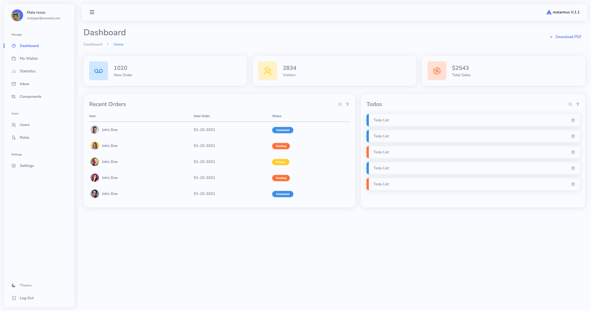
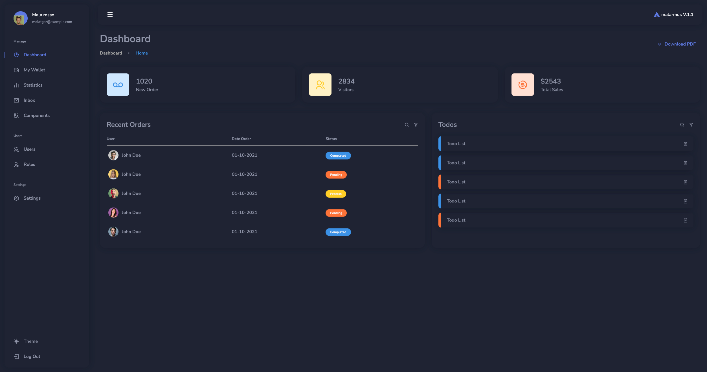
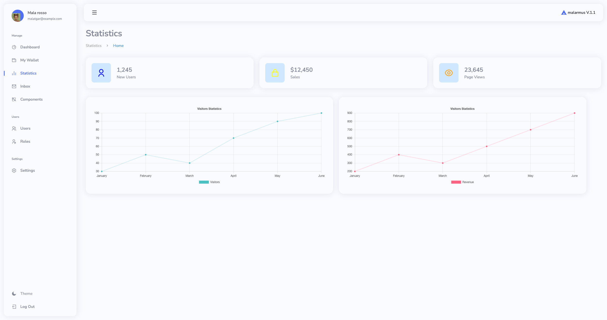
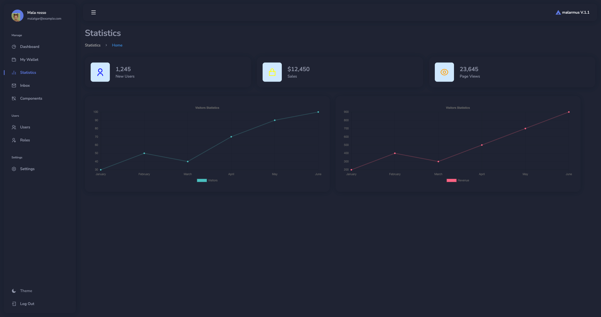
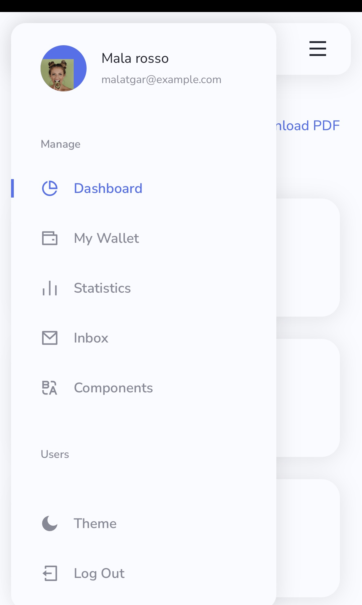
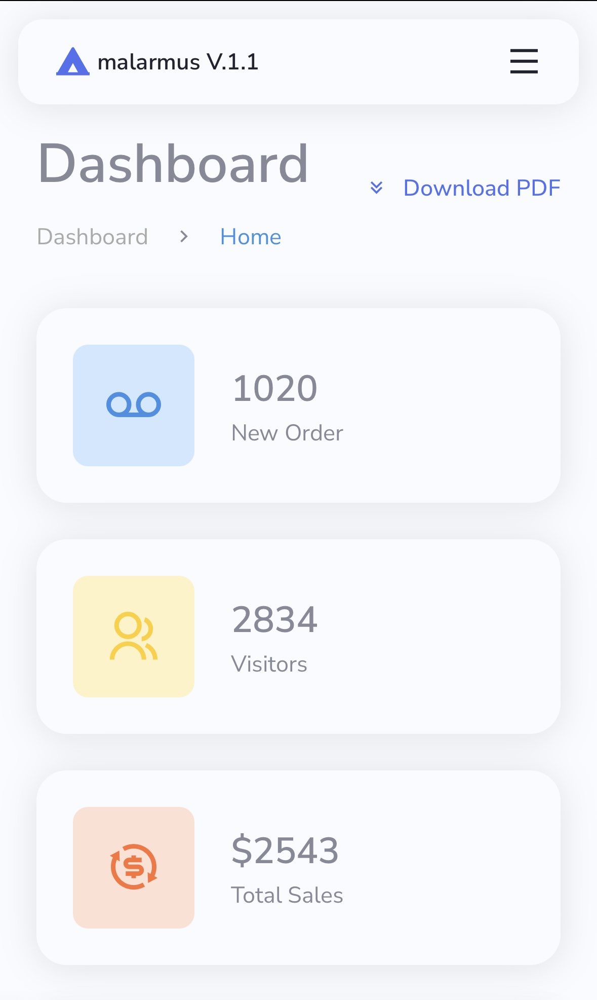

# React Admin Panel

## English

### Overview
The React Admin Panel is a versatile web-based platform designed to provide a comprehensive management interface for various applications. It offers a user-friendly dashboard, customizable components, and responsive design, making it suitable for managing different types of data and operations.

### Features
- **Dashboard**: Provides an overview of key metrics and data.
- **Customizable Components**: Easily adapt the panel to fit specific needs.
- **Responsive Design**: Ensures accessibility across various devices.
- **User Management**: Manage users and roles efficiently.
- **Theming**: Switch between different themes for a personalized experience.
- **Dark Mode**: Supports dark mode for a comfortable viewing experience in low-light environments.
- **Full Responsiveness**: Fully responsive design to ensure optimal viewing on all devices.

### Technologies Used
- **React**: A JavaScript library for building user interfaces.
- **React Router**: For handling navigation within the application.
- **Context API**: For state management across the application.
- **Framer Motion**: For animations and transitions.
- **CSS Modules**: For styling components with scoped CSS.
- **Responsive Design**: Implemented using CSS Flexbox and Grid.

### Installation
1. Clone the repository:
   ```bash
   git clone https://github.com/yourusername/react-admin-panel.git
   ```
2. Navigate to the project directory:
   ```bash
   cd react-admin-panel
   ```
3. Install dependencies:
   ```bash
   npm install
   ```
4. Start the application:
   ```bash
   npm start
   ```

### Usage
- Navigate to `http://localhost:3000` in your web browser to access the application.
- Use the sidebar to navigate between different sections of the application.

### Contributing
Contributions are welcome! Please fork the repository and submit a pull request for any improvements or bug fixes.


---

## Türkçe

### Genel Bakış
React Yönetim Paneli, çeşitli uygulamalar için kapsamlı bir yönetim arayüzü sunmak üzere tasarlanmış çok yönlü bir web tabanlı platformdur. Kullanıcı dostu bir gösterge paneli, özelleştirilebilir bileşenler ve duyarlı tasarım sunarak farklı türdeki veri ve işlemleri yönetmek için uygundur.

### Özellikler
- **Gösterge Paneli**: Anahtar metrikler ve verilerin genel görünümünü sağlar.
- **Özelleştirilebilir Bileşenler**: Paneli belirli ihtiyaçlara göre kolayca uyarlayın.
- **Duyarlı Tasarım**: Çeşitli cihazlarda erişilebilirliği sağlar.
- **Kullanıcı Yönetimi**: Kullanıcıları ve rolleri verimli bir şekilde yönetin.
- **Tema Desteği**: Farklı temalar arasında geçiş yaparak kişiselleştirilmiş bir deneyim sunar.
- **Karanlık Mod**: Düşük ışık koşullarında rahat bir görüntüleme deneyimi için karanlık mod desteği.
- **Tam Duyarlılık**: Tüm cihazlarda optimal görüntüleme için tamamen duyarlı tasarım.

### Kullanılan Teknolojiler
- **React**: Kullanıcı arayüzleri oluşturmak için bir JavaScript kütüphanesi.
- **React Router**: Uygulama içi gezinmeyi yönetmek için kullanılır.
- **Context API**: Uygulama genelinde durum yönetimi için kullanılır.
- **Framer Motion**: Animasyonlar ve geçişler için kullanılır.
- **CSS Modülleri**: Bileşenleri scoped CSS ile stillendirmek için kullanılır.
- **Duyarlı Tasarım**: CSS Flexbox ve Grid kullanılarak uygulanmıştır.

### Kurulum
1. Depoyu klonlayın:
   ```bash
   git clone https://github.com/yourusername/react-admin-panel.git
   ```
2. Proje dizinine gidin:
   ```bash
   cd react-admin-panel
   ```
3. Bağımlılıkları yükleyin:
   ```bash
   npm install
   ```
4. Uygulamayı başlatın:
   ```bash
   npm start
   ```

### Kullanım
- Web tarayıcınızda `http://localhost:3000` adresine giderek uygulamaya erişin.
- Uygulamanın farklı bölümleri arasında gezinmek için yan menüyü kullanın.

### Katkıda Bulunma
Katkılar memnuniyetle karşılanır! Herhangi bir iyileştirme veya hata düzeltmesi için lütfen depoyu çatallayın ve bir çekme isteği gönderin.


---

## Screenshots

### Dashboard



### Statistics



### Mobile



